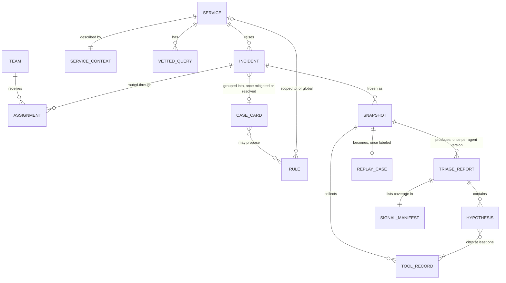
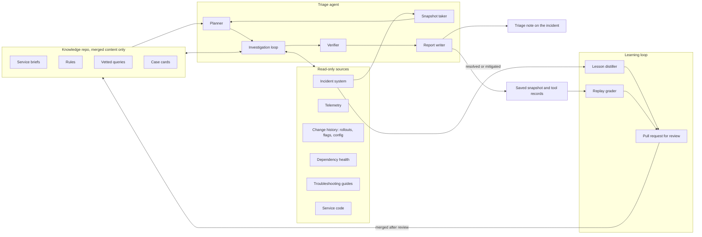
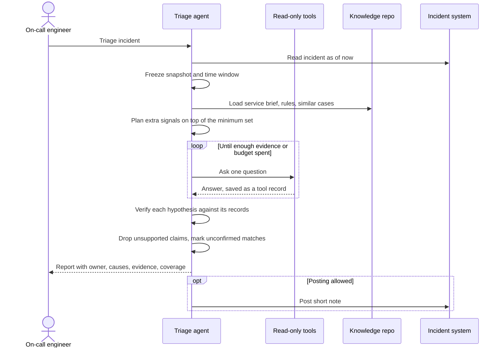
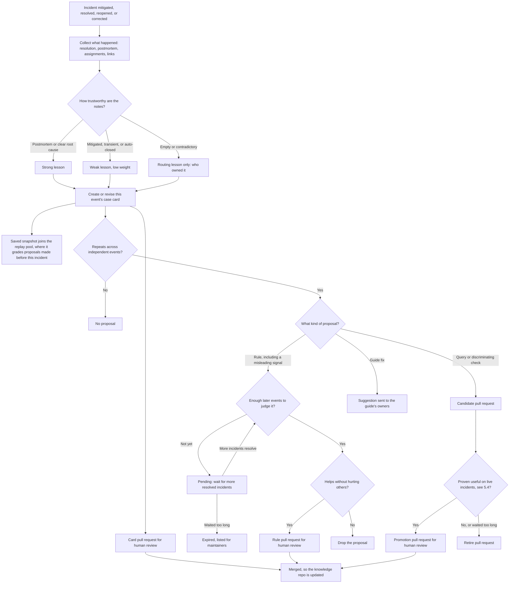
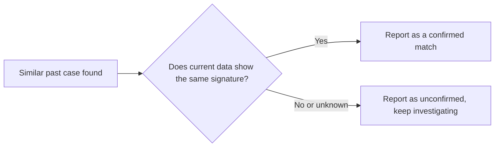
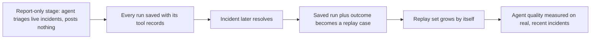
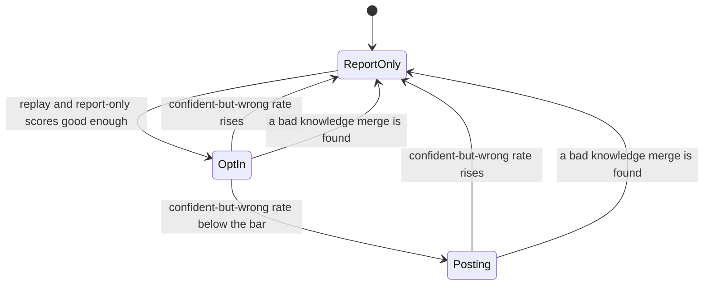

# Design: an ICM triage agent built on open-code-review's ideas

This document describes an agent that triages ICM incidents. ICM is the incident management system that pages on-call engineers and tracks each incident until it is resolved. It reuses the ideas that make open-code-review (`ocr`) and the `pr-review` skill that wraps it trustworthy. It also learns from incidents that have already been resolved or mitigated. This is a design only: it has no implementation details and no schedule.

Three sources are referred to throughout:

- **`ocr`** means this repository.
- **The `pr-review` skill** is the wrapper that pins a pull request, runs `ocr`, verifies each comment, and posts the confirmed ones. It lives outside this repository.
- **Our runs** are review experiments done while building that skill.

## The idea in one paragraph

`ocr` does not just ask a model "is this code good?". It reviews one exact diff, gives the model a short background and a few read-only tools, anchors each comment to the code it refers to and flags the ones it cannot place, and records which files it actually covered. The `pr-review` skill pins the pull request and checks each comment against the code before anyone acts on it.

An incident needs the same discipline:

- Pin the incident as it looked at one moment.
- Investigate it with read-only tools.
- Back every hypothesis with query results.
- Record which signals were checked.
- Verify claims before posting them.

The new part is learning. Every resolved incident becomes a lesson and, where possible, a test case. A lesson that changes what the agent checks or how it weighs a signal only takes effect after it is reviewed and has proven itself, on replay or on live incidents. Case cards on their own are reviewed and serve only as leads, which current data must confirm.

## 1. Requirements

### What it must do

| Priority | Requirement |
| --- | --- |
| Must | Read a new incident and say which team should own it, with the reason. |
| Must | Suggest the likely causes, each backed by evidence from live telemetry, recent changes, or dependency health. |
| Must | Point to similar past incidents and the troubleshooting guide that fits, and state whether the current data confirms the match. |
| Must | Say what it checked and what it could not check, and admit when it does not know. |
| Must | Learn from incidents once they are resolved or mitigated, without retraining a model. |
| Should | Flag likely duplicates of an incident that is already active. |
| Should | Post a short triage note to the incident. |
| Could | Suggest a severity correction, as a note only. |

### What it must never do

- It never mitigates, changes severity, transfers or closes an incident on its own. It reads and comments, and people act.
- It never treats a past incident as proof. A similar case is only a lead until current data confirms it.
- It never relies on learned knowledge that has not been reviewed and merged. The one exception is a rule's running score, which can only lower confidence in that rule, never raise it or add anything new. Outside documents such as troubleshooting guides are treated as leads, never as verdicts.

### Quality goals

| Quality | Goal |
| --- | --- |
| Trust | Confident but wrong answers are rare. This number matters more than any other, because one bad call makes on-call engineers ignore the tool. Confident means the agent marked a hypothesis as confirmed by current data. |
| Usefulness | The real cause appears among the top three hypotheses for most incidents. |
| Speed | A first useful note arrives within minutes. Reasoning depth is the main dial between speed and quality, and it is tuned by measurement, see 5.8. |
| Honesty | "Nothing found" always comes with the list of signals that were checked. |
| Repeatability | The same incident snapshot gives a comparable answer when replayed later. |
| Data safety | Incident and telemetry data only go to approved model endpoints, and identifiers are scrubbed from anything stored for learning. |

### Out of scope

- Automatic mitigation or remediation.
- Replacing the incident tool's own workflow, paging, or on-call rotations.
- A general chat assistant for incidents.

## 2. Core entities

| Entity | Plain meaning |
| --- | --- |
| Incident | The ICM item: title, alert, service, region, discussion and, later, its resolution. |
| Team and assignment | Who owned the incident and when. The assignment history is both what the agent predicts and, after resolution, the answer it is graded against. |
| Snapshot | The incident frozen at one moment, like the `pr-review` skill pinning the exact commit `ocr` reviews. It holds only what was known at that moment, never the resolution. An incident can be triaged more than once, so it can have several snapshots. |
| Service context | A short brief about one service: its parts, dependencies, where changes come from, and how severity is judged. It is the triage version of `ocr`'s background text, and it stays short for the same reason: `ocr` caps its background, and long briefs dilute attention. |
| Rule | A known pattern, such as "this alert plus this error code goes to team X" or "this signature is known issue Y". A rule is global or scoped to one service. All matching rules apply, and the service rule wins only when two rules disagree, for example on the owner. If two rules at the same level disagree, the report shows both and names no confident owner. This differs from `ocr`'s rule layers, where the first matching layer usually replaces the rest. In triage, a global known-issue rule is often the most useful hint during a shared outage, so it must not be hidden. |
| Vetted query | A telemetry query that has proven useful, kept with a description of when to use it. The agent supplies only typed, validated values such as a time range inside the snapshot's window or a resource ID that belongs to the incident's service. It cannot write its own queries against production data. |
| Tool record | One question the agent asked and the answer it got: a query and its rows, a change list, a dependency status. Every record is saved, which is what makes replay possible later. |
| Hypothesis | A possible cause, with at least one supporting tool record and a confidence level. It is the triage version of an anchored `ocr` comment, but stricter: a hypothesis whose citation does not hold up is dropped, while `ocr` still delivers a comment it cannot place. |
| Signal manifest | What was checked, what was skipped and why, what failed, and, during replay, which questions had no recorded answer. It is the triage version of `ocr`'s coverage manifest. |
| Triage report | The full answer: suggested owner, hypotheses, similar cases, next steps, manifest, and which agent version wrote it. |
| Case card | A lesson distilled from a resolved or mitigated event: symptoms, the checks that told causes apart, the real cause, the fix, the misleading signals, and how trustworthy the resolution notes were. There is one card per event, so duplicate, parent and child incidents share one card, and it is revised when the outcome changes. A card on its own only offers leads: the similar-case view shows its symptoms, cause and fix. Its misleading signals and discriminating checks stay hidden from the agent until they are promoted, see the learning flowchart. Each revision records when its content became knowable. |
| Replay case | A snapshot whose final outcome is known. It is used to grade the agent, like the `pr-review` skill's eval fixtures, which replay recorded results instead of calling live systems. |

## 3. How people and systems use it

There are four ways in, each a plain request and answer:

| Request | Who uses it | What comes back |
| --- | --- | --- |
| Triage this incident | An on-call engineer, or a hook when an incident is created | A triage report, and a posted note when allowed |
| Replay these past incidents | A maintainer checking quality | Scores per incident and in total, compared with the last accepted version |
| Learn from recently resolved incidents | A scheduled job | Proposed case cards and rule or query changes, opened as pull requests |
| Show what you know about this service | Anyone | The service brief, active rules, vetted queries, and how well each rule has performed |

### Identities

| Who triggers it | Reads with | Posts as |
| --- | --- | --- |
| An engineer asks for triage | That engineer's own read access | That engineer, the same way the `pr-review` skill posts under the reviewer's login |
| The new-incident hook, shadow mode, see 5.5, or the learning job | A dedicated reader identity: read-only, limited to onboarded services, and with every access logged | A named, clearly labeled bot identity, once posting is turned on for that service. `ocr`'s GitHub Action works the same way with the workflow's bot token. |

An engineer's own access may allow mitigation, transfer, or closing an incident, so the guarantee does not come from identity. It comes from the tools: whatever credential the agent holds, it gets only read-only tools plus one tool that posts a note. Where the incident system supports it, engineer-triggered runs use a down-scoped token rather than the engineer's full rights. The reader identity's scope is reviewed whenever a service is onboarded.

## 4. Architecture

### The big picture

The agent reads only merged knowledge, and it never uses candidate queries for triage, since those only fill saved records, see 5.4. Proposals still waiting for enough evidence sit in the learning loop's own queue, visible to maintainers and expired after a while, and never in the knowledge repo. Rule scores live in an append-only ledger that the agent reads only to lower confidence.

### What each part does

| Part | Job | Where the idea comes from |
| --- | --- | --- |
| Snapshot taker | Freezes the incident and fixes the time window every query uses. | The `pr-review` skill pinning the exact commit instead of a moving branch. |
| Planner | Reads the service brief and rules, and decides which extra signals are worth checking for this kind of alert. | `ocr`'s plan phase. `ocr`'s own architecture notes warn that a plan can become a coverage ceiling, so the planner only adds checks. A fixed minimum set always runs: recent changes, dependency health, and the alert's own signal. |
| Investigation loop | Asks one question at a time through narrow, read-only tools, and records every answer. | `ocr`'s tool loop with file read, code search and comment tools. |
| Verifier | Re-checks each hypothesis against its cited records and drops anything the data does not support. | The `pr-review` skill's rule that every comment is verified before it is reported. It is stricter than `ocr`'s own filter step, which only removes comments that are provably wrong. |
| Report writer | Writes the report and the short note, and lists coverage honestly. | `ocr`'s coverage manifest, and the `pr-review` skill's report template. |
| Knowledge repo | Holds what the agent knows, versioned and reviewed. | `ocr`'s rule files, kept in the repository and layered. |
| Lesson distiller | Turns resolved incidents into proposed case cards and rule or query changes. | New: this is the learning part. |
| Replay grader | Runs the agent on past snapshots with recorded answers and scores it. | The `pr-review` skill's eval fixtures. |

### Triaging one incident

### Learning from a resolved incident

Every case card, rule and query arrives as a pull request. Guide fixes go to the guide's owners, because guides are an outside source. Nothing reaches the knowledge repo, so nothing reaches the agent, without a human merge. `ocr` can review those pull requests too, because a knowledge change is just a reviewed file change.

A few rules keep the loop honest:

- **Count events, not tickets.** One outage can open many duplicate, parent and child incidents. They are collapsed into one event before anything is counted: repeats, grading minimums, stage-gate windows and similar-case results. A single bad day never looks like a strong pattern or fills a quota on its own.
- **Grade on later incidents only.** A proposal is graded only on incidents that happened after it was proposed, never on the incidents it came from. So each saved snapshot grades proposals made before its incident.
- **One card per event, revised over time.** An incident is often mitigated first and resolved later, and a postmortem can correct the cause weeks after that. Each change revises the same card instead of adding a new one. The scores of any rule that relied on the old version are recomputed.
- **Keep the review load small.** Weak and routing-only cards are batched into one pull request per service instead of one each.
- **Start with history.** At launch the knowledge repo is empty, so past resolved incidents are distilled into cards through the same review gate, rebuilt as they looked when created, see 5.2.

## 5. Deep dives

### 5.1 Good overfitting and bad overfitting

The agent is meant to fit your services closely. Knowing your alerts, dependencies and history is what makes it better than a generic assistant. That is good overfitting.

Bad overfitting is memorizing surface details. Two incidents can share a title and an alert name and still have completely different causes. The protections:

- **A match is a lead, never a verdict.** The past case must be confirmed by today's telemetry.
- **Test on the future, not the past.** Lessons are graded only on incidents that came after them. An incident is never graded against a case card made from itself, its duplicates, or its parent and child incidents. A proposal needs a minimum number of such events, per service or alert type, before it can pass. Until then it waits.
- **Every rule keeps a score.** Each time a rule fires, the eventual outcome says whether it was right. Scores come only from incidents where people could not have followed the agent, see 5.6, so a rule cannot grade itself. A falling score marks the rule as low-confidence in reports right away, and opens a pull request to demote or retire it. The rule only changes once that is merged.
- **Knowledge expires.** A case card or rule tied to a component that changed or was retired is flagged for review. Troubleshooting guides are read live, so the agent checks their last-updated date and any superseded markers, and treats a guide's diagnosis like a past case: a lead that current data must confirm. Stale documents produce confident wrong answers. In one of our runs, `ocr` raised a convincing comment based on a runbook that a newer document had already superseded, and only the verification step caught it.
- **Misleading signals are lessons too.** "This alert was a red herring four times out of five", once promoted to a rule and passed by replay, lowers that signal's weight in the hypotheses. The signal is still checked, since it belongs to the minimum set.

### 5.2 No peeking at the answer

Replay is only honest if the agent sees what the on-call engineer saw at the time. A snapshot excludes everything that happened later: later discussion, the resolution, later assignments, linked bugs. Without this, scores look great and mean nothing.

The same goes for knowledge. A replay uses only knowledge that existed at the snapshot time. Otherwise a card from a later recurrence could hand the agent the answer.

- **Case cards count from when their content became knowable.** Each revision of a card carries the time its source incidents were resolved or revised, not when it was merged, and a replay uses the latest revision knowable before the snapshot. So the history cards distilled at launch still serve replays of older incidents, and a later postmortem correction stays hidden from earlier replays.
- **Rules count from when they were merged, and queries from when they were promoted.** A candidate query's saved answers never grade that same query.
- **The rule-score ledger is append-only and sliced the same way.** A revised card appends correcting entries with their own known-at time instead of rewriting old ones, and only entries known before the snapshot count.
- **A proposal under test is laid over that knowledge.** The grader then compares the agent with and without the proposal.

This matters most for incidents older than the agent. Their current text already includes the ending. They are rebuilt as they looked when created, from the incident's edit and assignment history, or left out of grading.

### 5.3 Telemetry does not live forever

Telemetry data expires, so an old incident cannot be investigated again. That is why every live run saves its tool records. Once the incident resolves, the run becomes a complete replay case. Incidents from before the agent existed have no saved records. They can grade routing, similar-case search and cause category, but not the full investigation.

### 5.4 What replay cannot test

Replay only knows the answers to questions the original run asked. A change that makes the agent ask something new, such as a new vetted query or a rule that points at a different signal, meets questions with no recorded answer. Those questions are listed as unanswerable in the manifest and scored separately, so a change neither passes nor fails just because nothing could check it.

New queries and discriminating checks are proven forward instead. A proposed query or check is first reviewed and merged as a candidate. Candidates run on live incidents only to fill saved records, never reports or notes, and their results are compared with the outcomes once those incidents resolve. A candidate that helps becomes vetted through a second pull request, and one that does not is retired.

### 5.5 Trust before reach, and taking it back

The agent earns the right to post in stages, decided per service:

- **Report only, also called shadow mode:** reports go nowhere by default, and the replay grader compares them with real outcomes.
- **Opt-in:** on-call engineers ask for triage on specific incidents.
- **Posting:** the agent adds a short note to new incidents.

A service drops back to report-only when its confident-but-wrong rate rises above the bar, or when a merged lesson turns out to be wrong. It climbs back the same way it climbed the first time. The rate is measured over a fixed window with a minimum number of events, and dropping back takes a cooldown before climbing again, so a quiet service does not flip between stages after one or two incidents.

Notes use the one-sentence style the `pr-review` skill uses for review comments: lead with the answer, then the reason. Long notes are not read under pressure.

### 5.6 Not learning from itself

Once the agent posts notes, those notes become part of incident discussions. Filtering by author is not enough, because engineer-triggered notes are posted under the engineer's login. So every note carries its own hidden ID, much as `ocr`'s GitHub Action gives each review comment its own hidden ID, and the agent keeps its own record of every note it posted. The lesson distiller strips the marked or matching text, whoever the author is, and keeps the rest of the comment. An engineer who quotes the note to correct it is writing the most useful lesson of all.

People can also echo the agent: an engineer may copy its suggested cause into the resolution, or follow its routing. Simply dropping outcomes that match the agent would not work either, since correct calls always match and wrong ones never do, so the numbers would look far worse than they are. Instead, a random share of incidents in each service past the report-only stage has its note held back until the incident resolves. Rule scores and the measures in 5.10 come only from that held-back share and from the report-only stage, where nobody saw the agent's answer. Lessons whose resolution matches an earlier note are still flagged for the reviewer.

### 5.7 Incident text is untrusted

Titles, discussion and telemetry rows can contain text written by anyone, including attempts to steer the agent. The protections:

- **Data, not instructions.** Incident content goes to the model clearly marked as data. So does text inside case cards that was copied from incidents. Cards keep that free text separate from their structured fields, so a line a reviewer missed is still never read as an instruction.
- **Typed query values.** Vetted queries accept only typed, validated values, so crafted text cannot change a query or widen its scope. Each resource ID is checked to belong to the incident's service or one of its declared dependencies before the query runs, so naming an unrelated service's resources reads nothing.
- **Scoped notes.** A posted note only includes information the incident's audience is allowed to see. The agent does not copy data from another service's telemetry into it.
- **Reviewed learning.** Lessons pass through review, so a planted incident cannot quietly teach the agent a false rule.
- **Allow-listed tools.** Incident and telemetry MCP servers often offer write actions and free-form queries. `ocr` registers every tool a server advertises unless its config lists specific ones, so here each server gets an explicit allow-list of read-only tools, and the agent refuses to start a server whose list is empty. Free-form query tools are replaced by the vetted-query tool, and new tools are denied by default.

### 5.8 Reasoning depth

In our runs, `ocr` on the Copilot provider with Claude Opus and reasoning turned off judged mostly from the diff and made only one or two tool calls. For triage, that is the equivalent of judging from the incident title.

We compared every `reasoning_effort` value on two pull requests. This is a different setting from `ocr`'s `--effort`, which only controls review rounds.

- `xhigh` raised nearly every issue `max` did, in about half the time and with a fifth of the tokens.
- `high`, which is the Copilot provider's default, and every lower value missed most of those issues.

The triage agent starts at `xhigh`. In `ocr` this setting exists only for the Copilot provider, and it can fall short in two ways:

- A model that does not offer `xhigh` gets the next lower level it offers, or none if it offers nothing at or below `xhigh`.
- A model missing from Copilot's model list, or a failed lookup of that list, gets no reasoning at all. That is the shallow failure described above.

`ocr` works this out per request and does not report it, and a failed lookup is retried, so one run can mix calls with and without reasoning. The triage agent therefore records, for every model call, whether reasoning was sent, and any call sent without it marks the run as failed. Two pull requests are a small sample, so the replay grader re-checks the choice rather than assuming it carries over from code review.

In our runs, adding "focus on X" lines to the background also made the model skip things it should have checked. So the service brief states facts about the service and leaves the choice of where to look to the agent and its minimum set of checks.

### 5.9 Data safety

- Incident and telemetry data can contain customer identifiers. They go only to model endpoints approved for that data. `ocr` sends to whatever endpoint is configured and has no built-in redaction, so an endpoint allow-list and redaction are new work here. With Copilot the host comes from the login token unless `providers.github-copilot.url` is pinned, so pinning the approved host lets the allow-list be checked once in config. The token exchange and the model-list lookup still use the token's host even when a URL is pinned, so the allow-list must cover those too. Every model request must use HTTPS with certificate and host name checks, and a redirect to another host must be refused rather than followed. `ocr` does not enforce either today: it accepts `http://` URLs and follows redirects, so both are new work. Whether a Copilot subscription may receive incident data at all is still an open question.
- Saved tool records and case cards are scrubbed before they enter the knowledge repo or the replay set, and free text such as discussion and resolution notes is scrubbed before it reaches a pull request. Inside one snapshot, each identifier gets the same stand-in everywhere: in the incident, the questions and the answers. That way replayed questions still match their recorded answers. Stand-ins are never shared across incidents, and never a plain hash, so cards cannot be used to link or recover customers. If something slips through, there is a way to purge it from the repository history.
- Saved data keeps the stricter of two access levels: the incident's, and that of the source it was read from. Records from restricted incidents or sources, or from services that are not onboarded, stay out of the shared knowledge repo and replay set, or live in a store with matching access. Otherwise an engineer-triggered run could copy data to people who were never allowed to see it.
- Tools are read-only. Queries run only from the vetted list, with bounded time ranges and result sizes.

### 5.10 What to measure

| Measure | Why it matters |
| --- | --- |
| Right owner on the first try | The easiest win, with clear labels from the assignment history. |
| Real cause among the top three evidence-backed hypotheses | The core usefulness measure. |
| Confident but wrong rate | Decides whether people trust it, and drives the stage changes in 5.5. |
| How often it honestly says "not sure" | Saying "not sure" is better than guessing, but too much means it is not helping. |
| Time to the first useful note | Has to beat the on-call engineer's own first look. |
| Each rule's hit rate over time | Catches bad overfitting and stale knowledge early. |

Every measure except time to the first note comes from the held-back share and the report-only stage, see 5.6, so engineers copying the agent cannot make it look better or worse than it is.

### 5.11 What carries over, and what is new

| Reused | New for triage |
| --- | --- |
| `ocr`'s model providers, including the GitHub Copilot subscription and reasoning effort control | Incident, telemetry, change and dependency tools |
| `ocr`'s connection to tools through MCP servers, restricted to allow-listed read-only tools | Snapshot freezing with leak-free time windows |
| `ocr`'s plan and tool-loop pattern, with its known coverage-ceiling caveat | A minimum set of checks that always runs |
| `ocr`'s coverage manifest and status values | Case cards, their lifecycle, and the lesson distiller |
| The `pr-review` skill's verification rule, which is stricter than `ocr`'s filter step | Rule scoring on held-back incidents, decay and expiry |
| The `pr-review` skill's replayed eval fixtures | A replay grader that splits by time and handles unanswerable questions |
| The `pr-review` skill's one-sentence comment style and caller identity | A labeled bot identity, staged rollout, and an endpoint allow-list with redaction |

## Open questions

- Which model endpoint is approved for incident and telemetry data, and does that include a GitHub Copilot subscription?
- Which service goes first? It should have plenty of resolved incidents with useful resolution notes.
- Does an internal incident-triage effort already exist that this should feed into instead of duplicating?
- Who reviews lesson pull requests: the service's on-call owners, or a central group?
